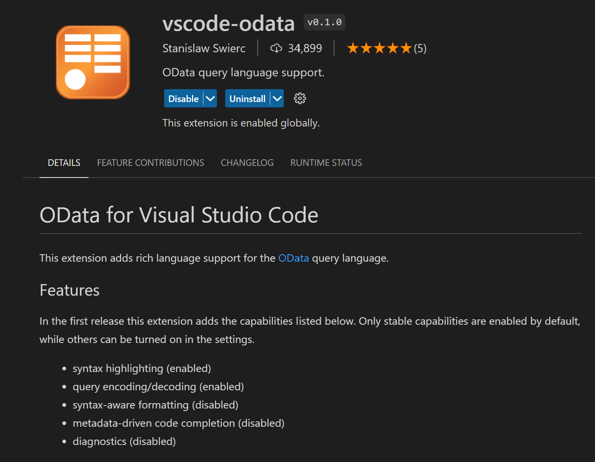
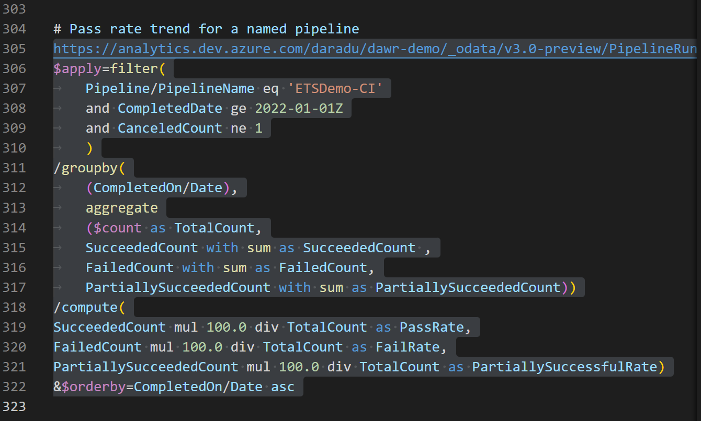
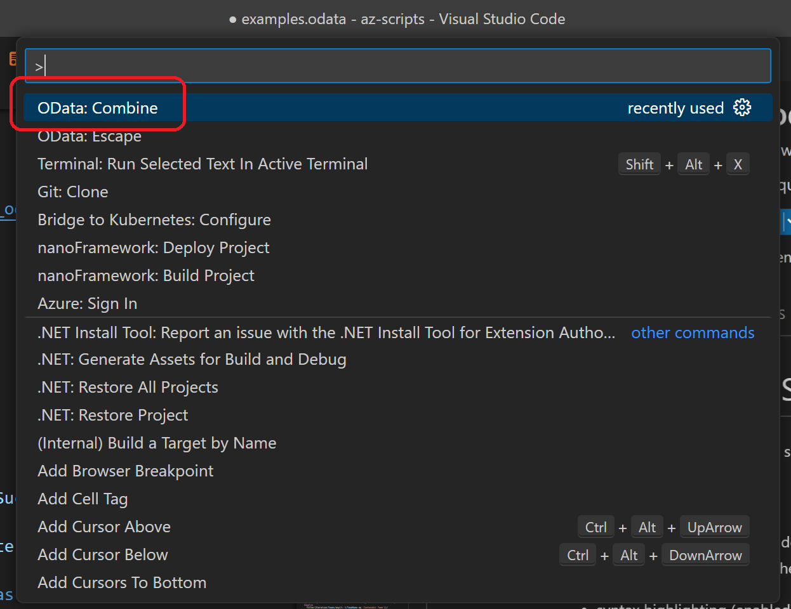
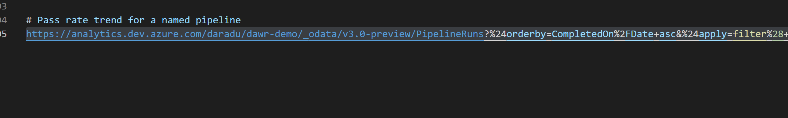

# Reporting

Azure DevOps provides OOTB tools for reporting and analytics using various dashboard and widgets.
Below is the documentation link to the widgets catalog:

https://learn.microsoft.com/en-us/azure/devops/report/dashboards/widget-catalog?view=azure-devops

For complex or custom reporting, the recommendation is to use a combination of the following:
- Azure DevOps REST API

https://learn.microsoft.com/en-us/rest/api/azure/devops/?view=azure-devops-rest-7.1

- Azure DevOps Analytics

https://learn.microsoft.com/en-us/azure/devops/report/powerbi/what-is-analytics?view=azure-devops

- PowerBI

https://learn.microsoft.com/en-us/azure/devops/report/powerbi/overview?view=azure-devops

- OData queries

https://learn.microsoft.com/en-us/azure/devops/report/extend-analytics/quick-ref?view=azure-devops

- Other tools & widgets, PowerShell, etc.

## Managing OData queries with VS Code

You can use the OData VS Code extension to manage OData queries. It provides features such as syntax highlighting and query encoding/decoding.



OData queries can be executed in the browser (authenticated request using the current Azure DevOps user credentials).
However, queries are usually complex and require multi-lines for editing.
An OData query can be written on multi-lines in the IDE, but when executed in the browser, it needs to be in a single line and encoded.

You can perform this encoding easily using the `vscode-odata` extension:

- Edit the query in a normal text editor (*.odata* files)

``` OData
# Pass rate trend for a named pipeline
https://analytics.dev.azure.com/daradu/dawr-demo/_odata/v3.0-preview/PipelineRuns?
$apply=filter(
	Pipeline/PipelineName eq 'ETSDemo-CI'
	and CompletedDate ge 2022-01-01Z
	and CanceledCount ne 1
	)
/groupby(
	(CompletedOn/Date),
	aggregate
	($count as TotalCount,
	SucceededCount with sum as SucceededCount ,
	FailedCount with sum as FailedCount,
	PartiallySucceededCount with sum as PartiallySucceededCount))
/compute(
SucceededCount mul 100.0 div TotalCount as PassRate,
FailedCount mul 100.0 div TotalCount as FailRate,
PartiallySucceededCount mul 100.0 div TotalCount as PartiallySuccessfulRate)
&$orderby=CompletedOn/Date asc

```

- Make a copy of the entire query block and select it



- Press CTRL+SHIFT+P (Command palette) and select **`OData: Combine`**



- The result will be encoded into a single line and you can use copy / paste to run it in the browser (or CTRL+click in VS Code editor)



## Burndown, Burnup, Velocity

### Burndown - Iteration

``` OData
https://analytics.dev.azure.com/{{org}}/{{project}}/_odata/v2.0/WorkItemSnapshot?$apply=
    filter(Iteration/Teams/any(t: t/TeamName eq '{{TeamName}}'))/
    filter(Iteration/IterationName eq '{{IterationName}}')/
    filter(WorkItemType in ('User Story', 'Bug'))/
	filter(not(State in ('{{ResolvedState}}', '{{ClosedState}}')))/
	filter(DateValue ge Iteration/StartDate and DateValue le Iteration/EndDate)/
	groupby(
		(DateValue), 
			aggregate(StoryPoints with sum as TotalStoryPoints)
		)
```

### Burndown by State - Iteration

``` OData
https://analytics.dev.azure.com/{{org}}/{{project}}/_odata/v2.0/WorkItemSnapshot?$apply=
    filter(Iteration/Teams/any(t: t/TeamName eq '{{TeamName}}'))/
    filter(Iteration/IterationName eq '{{IterationName}}')/
    filter(WorkItemType in ('User Story', 'Bug'))/
	filter(not(State in ('{{ResolvedState}}', '{{ClosedState}}')))/
	filter(DateValue ge Iteration/StartDate and DateValue le Iteration/EndDate)/
	groupby(
		(DateValue, State), 
			aggregate(StoryPoints with sum as TotalStoryPoints)
		)
```

### Burnup - Release

``` OData
https://analytics.dev.azure.com/{{org}}/{{project}}/_odata/v2.0/WorkItemSnapshot?$apply=
    filter(Iteration/Teams/any(t: t/TeamName eq '{{TeamName}}'))/
    filter(WorkItemType in ('User Story', 'Bug'))/
	filter(State in ('{{ResolvedState}}', '{{ClosedState}}'))/
	filter(DateValue ge {{ReleaseStartDate}} and DateValue le {{ReleaseEndDate}})/
	groupby(
		(DateValue), 
			aggregate(StoryPoints with sum as TotalStoryPoints)
		)
```

### Velocity

``` OData
https://analytics.dev.azure.com/{{org}}/{{project}}/_odata/v2.0/WorkItems?$apply=
    filter(Iteration/Teams/any(t: t/TeamName eq '{{TeamName}}'))/
    filter(WorkItemType in ('User Story', 'Bug'))/
	filter(State in ('{{ResolvedState}}', '{{ClosedState}}'))/
	groupby(
		(Iteration/IterationName), 
			aggregate(StoryPoints with sum as TotalStoryPoints)
		)
```

## Azure Boards queries

See documentation here:

https://learn.microsoft.com/en-us/azure/devops/report/extend-analytics/quick-ref?view=azure-devops#azure-boards-sample-widgets-and-reports

### Bug trend filtered by Area Path

``` OData
https://analytics.dev.azure.com/{organization}/{project}/_odata/v3.0-preview/WorkItemSnapshot? 
        $apply=filter(
            WorkItemType eq 'Bug'
            and State ne 'Closed'
            and startswith(Area/AreaPath,'{areapath}')
            and DateValue ge {startdate} 
            )
        /groupby(
            (DateValue,State,WorkItemType,Priority,Severity,Area/AreaPath,Iteration/IterationPath,AreaSK),
            aggregate($count as Count)
            )
```

### Rollup Story Points to Features of child User Stories based on Area Path

``` OData
https://analytics.dev.azure.com/{organization}/{project}/_odata/v3.0-preview/WorkItems?
    $filter=WorkItemType eq 'Feature'
        and State ne 'Cut'
        and startswith(Area/AreaPath,'{areapath}')
        and Descendants/any()
    &$select=WorkItemId,Title,WorkItemType,State,AreaSK
    &$expand=AssignedTo($select=UserName),Iteration($select=IterationPath),Area($select=AreaPath),
        Descendants(
        $apply=filter(WorkItemType eq 'User Story')
        /aggregate($count as CountOfUserStories, StoryPoints with sum as TotalStoryPoints)
        )
```

### Rollup Tasks Remaining Work and Completed Work to User Stories

``` OData
https://analytics.dev.azure.com/{organization}/{project}/_odata/v3.0-preview/WorkItems?
    $filter=WorkItemType eq 'User Story'
        and State ne 'Removed'
        and startswith(Area/AreaPath,'{areapath}')
        and Descendants/any()
    &$select=WorkItemId,Title,WorkItemType,State,AreaSK
    &$expand=AssignedTo($select=UserName),Iteration($select=IterationPath),Area($select=AreaPath),
        Descendants(
        $apply=filter(WorkItemType eq 'Task')
        /aggregate(RemainingWork with sum as TotalRemainingWork, CompletedWork with sum as TotalCompletedWork)
        )
```

### Rollup Bug count to Features

``` OData
https://analytics.dev.azure.com/{organization}/{project}/_odata/v3.0-preview/WorkItems?
    $filter=WorkItemType eq 'Feature'
        and State ne 'Removed'
        and startswith(Area/AreaPath,'{areapath}')
        and Descendants/any()
    &$select=WorkItemId,Title,WorkItemType,State,AreaSK
    &$expand=AssignedTo($select=UserName),Iteration($select=IterationPath),Area($select=AreaPath),
        Descendants(
        $apply=filter(WorkItemType eq 'Bug')
        /aggregate($count as CountOfBugs)
        )
```

### Review feature progress based on an area path

``` OData
https://analytics.dev.azure.com/{organization}/{project}/_odata/v3.0-preview/WorkItems?
        $filter=WorkItemType eq 'Feature'
            and State ne 'Removed'
            and startswith(Area/AreaPath,'{areapath}')
            and Descendants/any()
        &$select=WorkItemId,Title,Area,Iteration,AssignedTo,WorkItemType,State,AreaSK
        &$expand=Descendants(
            $apply=filter(WorkItemType eq 'User Story')
                /groupby((StateCategory),
                aggregate(StoryPoints with sum as TotalStoryPoints))
            )
```


### Return Features and their child User Stories

``` OData
https://analytics.dev.azure.com/{organization}/{project}/_odata/v3.0-preview/WorkItems?
        $filter=WorkItemType eq 'Feature'
            and State ne 'Closed' and State ne 'Removed'
            and startswith(Area/AreaPath,'{areapath}')
        &$select=WorkItemId,Title,WorkItemType,State,AreaSK
        &$expand=AssignedTo($select=UserName),Iteration($select=IterationPath),Area($select=AreaPath),
                Links(
                    $filter=LinkTypeName eq 'Child'
                        and TargetWorkItem/WorkItemType eq 'User Story';
                    $select=LinkTypeName;
                    $expand=TargetWorkItem($select=WorkItemType,WorkItemId,Title,State)
                )
```

### Burndown of User Stories in an area path from start and end date

``` OData
https://analytics.dev.azure.com/{organization}/{project}/_odata/v3.0-preview/WorkItemSnapshot?
        $apply=filter(WorkItemType eq 'User Story'
            and StateCategory ne 'Completed'
            and startswith(Area/AreaPath,'{areapath}')
            and Tags/any(x:x/TagName eq '{tagname}')
            and DateValue ge {startdate}
            and DateValue le {enddate}
        )
        /groupby (
            (DateValue,State,Area/AreaPath),
            aggregate ($count as Count, StoryPoints with sum as TotalStoryPoints)
        )
```

### Burndown User Stories for an area path and the current iteration

``` OData
https://analytics.dev.azure.com/{organization}/{project}/_odata/v3.0-preview/WorkItemSnapshot? 
        $apply=filter(
            WorkItemType eq 'User Story'
            and startswith(Area/AreaPath,'{areapath}')
            and StateCategory ne 'Completed'
            and DateValue ge Iteration/StartDate
            and DateValue le Iteration/EndDate
            and Iteration/StartDate le now() 
            and Iteration/EndDate ge now()
        )
        /groupby(
            (DateValue,State,WorkItemType,Priority,Area/AreaPath,Iteration/IterationPath),
            aggregate($count as Count, StoryPoints with sum as TotalStoryPoints)
        )
```

### Cumulative Flow Diagram (CFD)

``` OData
https://analytics.dev.azure.com/{organization}/{project}/_odata/V3.0-preview/WorkItemBoardSnapshot?
        $apply=filter(
            Team/TeamName eq '{teamname}'
            and BoardName eq 'Stories' 
            and DateValue ge {startdate}
        )
        /groupby(
            (DateValue,ColumnName,LaneName,State,WorkItemType,AssignedTo/UserName,Area/AreaPath), 
            aggregate($count as Count)
        )
```

### Return Lead Time and Cycle Time for User Stories and Area Path

``` OData
https://analytics.dev.azure.com/{organization}/{project}/_odata/v3.0-preview/WorkItems?
        $filter=WorkItemType eq 'User Story'
            and StateCategory eq 'Completed'
            and CompletedDate ge {startdate}
            and startswith(Area/AreaPath,'{areapath}')
        &$select=WorkItemId,Title,WorkItemType,State,Priority,AreaSK
            ,CycleTimeDays,LeadTimeDays,CompletedDateSK
        &$expand=AssignedTo($select=UserName),Iteration($select=IterationPath),Area($select=AreaPath)
```

### Return Lead Time and Cycle Time for User Stories and teams

``` OData
https://analytics.dev.azure.com/{organization}/{project}/_odata/v3.0-preview/WorkItems?
        $filter=WorkItemType eq 'User Story'
            and StateCategory eq 'Completed'
            and CompletedDate ge {startdate}
            and (Teams/any(x:x/TeamName eq '{teamname}') or Teams/any(x:x/TeamName eq '{teamname}') or Teams/any(x:x/TeamName eq '{teamname}')
        &$select=WorkItemId,Title,WorkItemType,State,Priority,AreaSK
            ,CycleTimeDays,LeadTimeDays,CompletedDateSK
        &$expand=AssignedTo($select=UserName),Iteration($select=IterationPath),Area($select=AreaPath)
```


## Azure Pipelines

See examples here:

https://learn.microsoft.com/en-us/azure/devops/report/extend-analytics/quick-ref?view=azure-devops#azure-pipelines-sample-widgets-and-reports

The queries have been added to the *queries.odata* file:


### Pipeline duration for a named pipeline

``` OData
https://analytics.dev.azure.com/{organization}/{project}/_odata/v3.0-preview/PipelineRuns?
$apply=filter(
	Pipeline/PipelineName eq '{pipelineName}'
	and CompletedDate ge {startdate}
	)
/aggregate(
	$count as TotalCount,
	SucceededCount with sum as SucceededCount ,
	FailedCount with sum as FailedCount,
	PartiallySucceededCount with sum as PartiallySucceededCount ,
	CanceledCount with sum as CanceledCount
	)
```

### Outcome summary for all project pipelines

``` OData
https://analytics.dev.azure.com/{organization}/{project}/_odata/v3.0-preview/PipelineRuns?
$apply=filter(
    CompletedDate ge {startdate}
    )
/groupby(
(Pipeline/PipelineName),
aggregate(
    $count as TotalCount,
    SucceededCount with sum as SucceededCount ,
    FailedCount with sum as FailedCount,
    PartiallySucceededCount with sum as PartiallySucceededCount ,
    CanceledCount with sum as CanceledCount
    ))
```

### Outcome summary for all pipelines

``` OData
https://analytics.dev.azure.com/{organization}/{project}/_odata/v3.0-preview/PipelineRuns?%20
$apply=filter(
	CompletedDate ge {startdate}
	)
/groupby(
(Pipeline/PipelineName), 
aggregate(
	$count as TotalCount,
	SucceededCount with sum as SucceededCount,
	FailedCount with sum as FailedCount,
	PartiallySucceededCount with sum as PartiallySucceededCount,
	CanceledCount with sum as CanceledCount
))
```

### Pass rate trend for a named pipeline

``` OData
https://analytics.dev.azure.com/{organization}/{project}/_odata/v3.0-preview/PipelineRuns?
$apply=filter(
	Pipeline/PipelineName eq '{pipelineName}'
	and CompletedDate ge {startdate}
	and CanceledCount ne 1
	)
/groupby(
	(CompletedOn/Date),
	aggregate
	($count as TotalCount,
	SucceededCount with sum as SucceededCount ,
	FailedCount with sum as FailedCount,
	PartiallySucceededCount with sum as PartiallySucceededCount))
/compute(
SucceededCount mul 100.0 div TotalCount as PassRate,
FailedCount mul 100.0 div TotalCount as FailRate,
PartiallySucceededCount mul 100.0 div TotalCount as PartiallySuccessfulRate)
&$orderby=CompletedOn/Date asc
```

### Return percentile durations for all project pipelines

``` OData
https://analytics.dev.azure.com/{organization}/{project}/_odata/v3.0-preview/PipelineRuns?
$apply=filter(
    CompletedDate ge {startdate}
    and (SucceededCount eq 1 or PartiallySucceededCount eq 1)
    )
/compute(
    percentile_cont(TotalDurationSeconds, 0.5, PipelineId) as Duration50thPercentileInSeconds,
    percentile_cont(TotalDurationSeconds, 0.8, PipelineId) as Duration80thPercentileInSeconds,
    percentile_cont(TotalDurationSeconds, 0.95, PipelineId) as Duration95thPercentileInSeconds)
/groupby(
(Duration50thPercentileInSeconds, Duration80thPercentileInSeconds,Duration95thPercentileInSeconds, Pipeline/PipelineName))
```

### Duration trend for all project pipelines

``` OData
https://analytics.dev.azure.com/{organization}/{project}/_odata/v3.0-preview/PipelineRuns?
$apply=filter(
    CompletedDate ge {startdate}
    and (SucceededCount eq 1 or PartiallySucceededCount eq 1)
    )
/compute(
    percentile_cont(TotalDurationSeconds, 0.8,PipelineId, CompletedDateSK) as Duration80thPercentileInSeconds)
/groupby(
    (Duration80thPercentileInSeconds, Pipeline/PipelineName, CompletedOn/Date))
&$orderby=CompletedOn/Date asc
```

### Task duration

``` OData
https://analytics.dev.azure.com/{organization}/{project}/_odata/v3.0-preview/PipelineRunActivityResults?
$apply=filter(
    Pipeline/PipelineName eq '{pipelinename}'
    and PipelineRunCompletedOn/Date ge {startdate}
    and (PipelineRunOutcome eq 'Succeed' or PipelineRunOutcome eq 'PartiallySucceeded')
    and (CanceledCount ne 1 and SkippedCount ne 1 and AbandonedCount ne 1)
    )
/compute(
    percentile_cont(ActivityDurationSeconds, 0.5, TaskDisplayName) as TaskDuration50thPercentileInSeconds,
    percentile_cont(ActivityDurationSeconds, 0.8, TaskDisplayName) as TaskDuration80thPercentileInSeconds,
    percentile_cont(ActivityDurationSeconds, 0.95, TaskDisplayName) as TaskDuration95thPercentileInSeconds)
/groupby(
    (TaskDuration50thPercentileInSeconds, TaskDuration80thPercentileInSeconds,TaskDuration95thPercentileInSeconds, TaskDisplayName))
&$orderby=TaskDuration50thPercentileInSeconds desc
```

### Task duration trend for specified pipeline name

``` OData
https://analytics.dev.azure.com/{organization}/{project}/_odata/v3.0-preview/PipelineRunActivityResults?
$apply=filter(
    Pipeline/PipelineName eq '{pipelinename}'
    and TaskDisplayName eq '{taskname}'
    and PipelineRunCompletedOn/Date ge {startdate}
    and (PipelineRunOutcome eq 'Succeed' or PipelineRunOutcome eq 'PartiallySucceeded')
    and (CanceledCount ne 1 and SkippedCount ne 1 and AbandonedCount ne 1)
    )
/compute(
    percentile_cont(ActivityDurationSeconds, 0.8, PipelineRunCompletedDateSK) as TaskDuration80thPercentileInSeconds)
/groupby(
    (TaskDuration80thPercentileInSeconds, PipelineRunCompletedOn/Date))
&$orderby=PipelineRunCompletedOn/Date asc
```


## Pipeline Tests

See documentation here:

https://learn.microsoft.com/en-us/azure/devops/report/extend-analytics/quick-ref?view=azure-devops#azure-pipelines-sample-widgets-and-reports

### Test summary for Build workflow

``` OData
https://analytics.dev.azure.com/{organization}/{project}/_odata/v4.0-preview/TestResultsDaily?
$apply=filter(
	Pipeline/PipelineName eq '{pipelineName}'
	And DateSK ge {startdate}
	And Workflow eq 'Build'
	)
	/aggregate(
		ResultCount with sum as ResultCount,
		ResultPassCount with sum as ResultPassCount,
		ResultFailCount with sum as ResultFailCount,
		ResultNotExecutedCount with sum as ResultNotExecutedCount,
		ResultNotImpactedCount with sum as ResultNotImpactedCount
	)
```

### Test summary trend for Build workflow

``` OData
https://analytics.dev.azure.com/{organization}/{project}/_odata/v4.0-preview/TestRuns?
$apply=filter(
	Pipeline/PipelineName eq '{pipelineName}'
	and CompletedOn/Date ge {startdate}
	and Workflow eq 'Build'
	)
/groupby(
	(CompletedOn/Date), 
	aggregate(
	ResultCount with sum as ResultCount,
	ResultPassCount with sum as ResultPassCount,
	ResultNotExecutedCount with sum as ResultNotExecutedCount,
	ResultNotImpactedCount with sum as ResultNotImpactedCount,
	ResultFailCount with sum as ResultFailCount
	))
/compute(
iif(ResultCount gt ResultNotExecutedCount, ((ResultPassCount add ResultNotImpactedCount) div cast(ResultCount sub ResultNotExecutedCount, Edm.Decimal)) mul 100, 0) as PassRate)
```


### Failed tests for a Build workflow

``` OData
https://analytics.dev.azure.com/{organization}/{project}/_odata/v4.0-preview/TestResultsDaily?
$apply=filter(
	Pipeline/PipelineName eq '{pipelineName}'
	And Date/Date ge {startdate}
	And Workflow eq 'Build'
	)
/groupby(
	(TestSK, Test/TestName), 
	aggregate(
	ResultCount with sum as TotalCount,
	ResultPassCount with sum as PassedCount,
	ResultFailCount with sum as FailedCount,
	ResultNotExecutedCount with sum as NotExecutedCount,
	ResultNotImpactedCount with sum as NotImpactedCount,
	ResultFlakyCount with sum as FlakyCount))
/filter(FailedCount gt 0)
/compute(
iif(TotalCount gt NotExecutedCount, ((PassedCount add NotImpactedCount) div cast(TotalCount sub NotExecutedCount, Edm.Decimal)) mul 100, 0) as PassRate)
```

### Flaky tests for a Build workflow

``` OData
https://analytics.dev.azure.com/{organization}/{project}/_odata/v4.0-preview/TestResultsDaily?
$apply=filter(
	Pipeline/PipelineName eq '{pipelineName}'
	And Date/Date ge {startdate}
	And Workflow eq 'Build'
	)
/groupby(
	(TestSK, Test/TestName), 
	aggregate(
	ResultCount with sum as TotalCount,
	ResultPassCount with sum as PassedCount,
	ResultFailCount with sum as FailedCount,
	ResultNotExecutedCount with sum as NotExecutedCount,
	ResultNotImpactedCount with sum as NotImpactedCount,
	ResultFlakyCount with sum as FlakyCount))
/filter(FlakyCount gt 0)
/compute(
	(FlakyCount div cast(TotalCount, Edm.Decimal)) mul 100 as FlakyRate
)
```

### Test duration for Build workflow

``` OData
https://analytics.dev.azure.com/{organization}/{project}/_odata/v4.0-preview/TestResultsDaily?
$apply=filter(
	Pipeline/PipelineName eq '{pipelineName}'
	And Date/Date ge {startdate}
	And Workflow eq 'Build'
	)
/groupby(
	(TestSK, Test/TestName), 
	aggregate(
	ResultCount with sum as TotalCount,
	ResultDurationSeconds with sum as TotalDuration
	))
/compute(
TotalDuration div TotalCount as AvgDuration)
```

### Test duration trend

``` OData
https://analytics.dev.azure.com/{organization}/{project}/_odata/v4.0-preview/TestResultsDaily?
$apply=filter(
	Pipeline/PipelineName eq '{pipelineName}'
	And Date/Date ge {startdate}
	And Workflow eq 'Build'
	)
/groupby(
	(TestSK, Test/TestName), 
	aggregate(
	ResultCount with sum as TotalCount,
	ResultDurationSeconds with sum as TotalDuration
	))
/compute(
TotalDuration div TotalCount as AvgDuration)
```

### Pass rate trend of test

``` OData
https://analytics.dev.azure.com/{organization}/{project}/_odata/v4.0-preview/TestResultsDaily?
$apply=filter(
	Pipeline/PipelineName eq '{pipelineName}'
	And Date/Date ge {startdate}
	And Test/TestName eq '{testName}'
	And Workflow eq 'Build')
/groupby((Date/Date), 
	aggregate(
	ResultCount with sum as TotalCount,
	ResultPassCount with sum as ResultPassCount,
	ResultFailCount with sum as ResultFailCount,
	ResultAbortedCount with sum as ResultAbortedCount,
	ResultErrorCount with sum as ResultErrorCount,
	ResultInconclusiveCount with sum as ResultInconclusiveCount,
	ResultNotExecutedCount with sum as ResultNotExecutedCount,
	ResultNotImpactedCount with sum as ResultNotImpactedCount))
/filter(ResultFailCount gt 0)
/compute(
	iif(TotalCount gt ResultNotExecutedCount, ((ResultPassCount add ResultNotImpactedCount) div cast(TotalCount sub ResultNotExecutedCount, Edm.Decimal)) mul 100, 0) as PassRate)
```

## Test Plans

See documentation here:

https://learn.microsoft.com/en-us/azure/devops/report/extend-analytics/quick-ref?view=azure-devops#azure-test-plans-sample-widgets-and-reports

### Progress status

``` OData
https://analytics.dev.azure.com/{organization}/{project}/_odata/v3.0-preview/TestPoints? 
$apply=filter(TestSuite/TestPlanTitle eq '{testPlanTitle}')
/aggregate( 
    $count as TotalCount,  
    cast(LastResultOutcome eq 'Passed', Edm.Int32) with sum as Passed,  
    cast(LastResultOutcome eq 'Failed', Edm.Int32) with sum as Failed, 
    cast(LastResultOutcome eq 'Blocked', Edm.Int32) with sum as Blocked, 
    cast(LastResultOutcome eq 'NotApplicable', Edm.Int32) with sum as NotApplicable, 
    cast(LastResultOutcome eq 'None', Edm.Int32) with sum as NotExecuted, 
    cast(LastResultOutcome ne 'None', Edm.Int32) with sum as Executed 
)
/compute( 
    Executed mul 100 div TotalCount as ExecPct, 
    iif(TotalCount gt NotExecuted, Passed mul 100 div Executed,0) as PassedPct 
)
```

### Query for percentage of hours completion for requirements

``` OData
https://analytics.dev.azure.com/{organization}/{project}/_odata/v3.0-preview/WorkItems? 
$filter=(
    IterationSK eq {iterationSK}
    and AreaSK eq {areaSK}
    and Processes/any(p:p/BacklogType eq 'RequirementBacklog') 
    and Processes/all(p:p/IsBugType eq false)
)
&$expand=Descendants(
    $apply=filter(
        CompletedWork ne null 
        or RemainingWork ne null
    )
    /aggregate(
        iif(CompletedWork ne null, CompletedWork, 0) with sum as SumCompletedWork, 
        iif(RemainingWork ne null, RemainingWork, 0) with sum as SumRemainingWork
    )
    /compute(
        (SumCompletedWork add SumRemainingWork) as TotalWork, 
        SumCompletedWork as SumCompleted
    )
    /compute(
        iif(TotalWork gt 0,(SumCompleted div cast(TotalWork, Edm.Double) mul 100), 0) as PercCompletedWork
    )
)&$select=WorkItemId, Title
```

### Query for percentage of hours completion for requirements

``` OData
https://analytics.dev.azure.com/{organization}/{project}/_odata/v3.0-preview/WorkItems? 
$filter=( 
    IterationSK eq {iterationSK}
    and AreaSK eq {areaSK}
    and WorkItemType eq 'Feature'
)
&$expand=Descendants( 
    $apply=filter( CompletedWork ne null or RemainingWork ne null ) 
    /aggregate( 
        iif(CompletedWork ne null, CompletedWork, 0) with sum as SumCompletedWork, 
        iif(RemainingWork ne null, RemainingWork, 0) with sum as SumRemainingWork 
    ) 
    /compute( 
        (SumCompletedWork add SumRemainingWork) as TotalWork, 
        SumCompletedWork as SumCompleted 
    ) 
    /compute( 
        iif(TotalWork gt 0,(SumCompleted div cast(TotalWork, Edm.Double) mul 100), 0) as PercCompletedWork 
    ) 
)
&$select=WorkItemId, Title
```

### Execution trend

``` OData
https://analytics.dev.azure.com/{organization}/{project}/_odata/v3.0-preview/TestPointHistorySnapshot? 
$apply=filter( 
    (TestSuite/TestPlanTitle eq '{testPlanTitle}') and (DateSK ge {startDate} and DateSK le {endDate}) 
)
/groupby( 
    (DateSK),  
    aggregate( 
        $count as TotalCount, 
        cast(ResultOutcome  eq 'Passed', Edm.Int32) with sum as Passed, 
        cast(ResultOutcome  eq 'Failed', Edm.Int32) with sum as Failed, 
        cast(ResultOutcome eq 'Blocked', Edm.Int32) with sum as Blocked, 
        cast(ResultOutcome eq 'NotApplicable', Edm.Int32) with sum as NotApplicable, 
        cast(ResultOutcome eq 'None', Edm.Int32) with sum as NotExecuted,  
        cast(ResultOutcome ne 'None', Edm.Int32) with sum as Executed 
    ) 
)
```

### Suite-level aggregation

``` OData
https://analytics.dev.azure.com/{organization}/{project}/_odata/v3.0-preview/TestPoints?  
$apply=filter((TestSuite/TestPlanTitle eq '{testPlanTitle}' and TestSuite/IdLevel3 ne null)) 
/groupby( 
    (TestSuite/TitleLevel3), 
    aggregate( 
        $count as TotalCount,  
        cast(LastResultOutcome eq 'Passed', Edm.Int32) with sum as PassedCount, 
        cast(LastResultOutcome eq 'Failed', Edm.Int32) with sum as FailedCount, 
        cast(LastResultOutcome eq 'None', Edm.Int32) with sum as  NotRunCount, 
        cast(LastResultOutcome ne 'None', Edm.Int32) with sum as RunCount 
    )
)
/compute( 
    RunCount mul 100 div TotalCount as RunPercentage, 
    NotRunCount mul 100 div TotalCount as NotRunPercentage, 
    iif(TotalCount gt NotRunCount, PassedCount mul 100 div RunCount,0) as PassedPercentage, 
    iif(TotalCount gt NotRunCount, FailedCount mul 100 div RunCount,0) as FailedPercentage 
) 
&$orderby=RunPercentage desc
```

### Test by outcome matrix

``` OData
https://analytics.dev.azure.com/{organization}/{project}/_odata/v3.0-preview/TestPoints?  
    $apply=filter((TestSuite/TestPlanTitle eq '{testPlanTitle}')) 
    /groupby(
        (Tester/UserName, LastResultOutcome),  
        aggregate($count as Count) 
    )
```

### Configuration by outcome matrix

``` OData
https://analytics.dev.azure.com/{organization}/{project}/_odata/v3.0-preview/TestPoints?  
    $apply=filter((TestSuite/TestPlanTitle eq '{testPlanTitle}')) 
    /groupby( 
        (TestConfiguration/Name, LastResultOutcome),  
        aggregate($count as Count) 
    )
```
